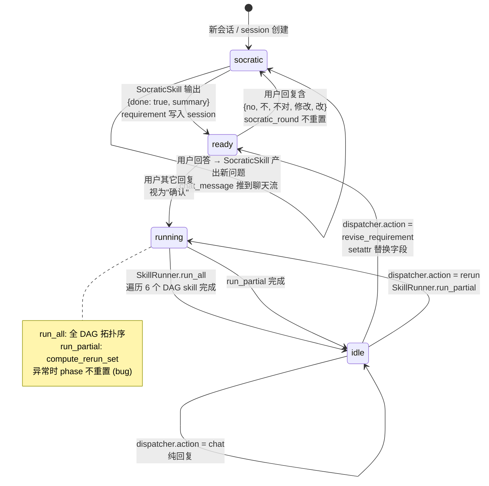
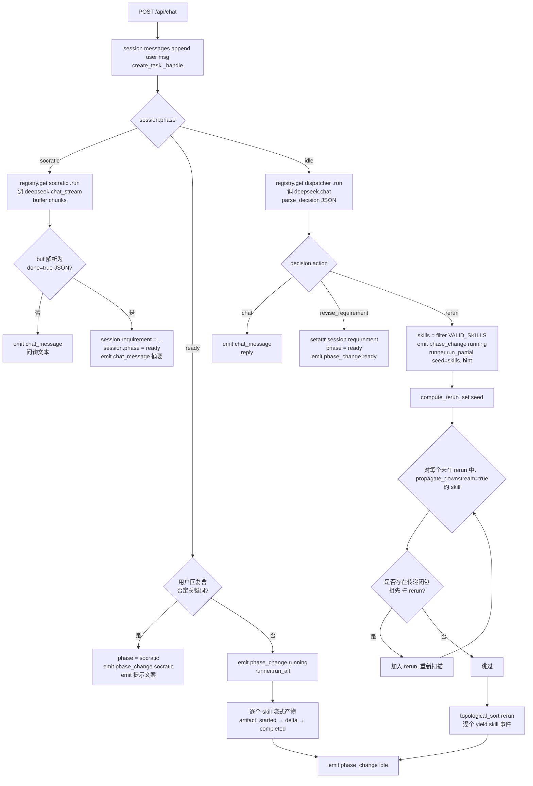
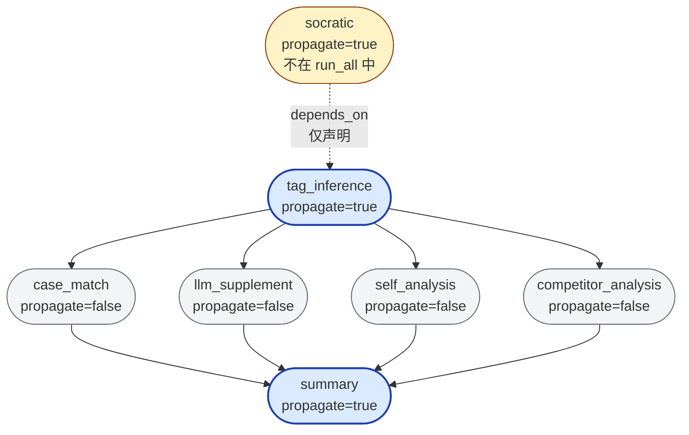
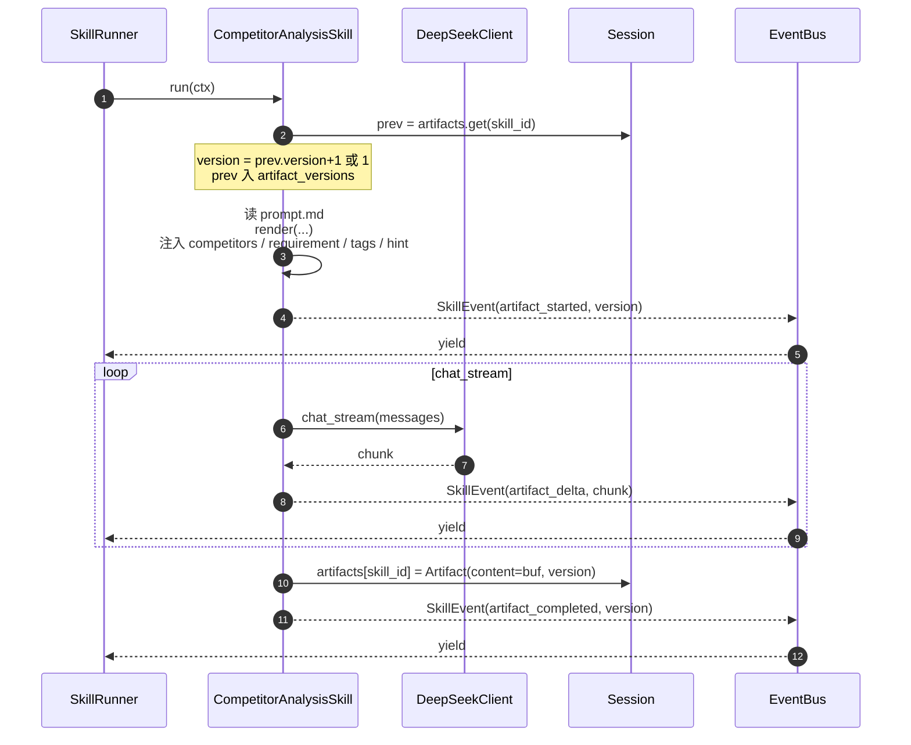

# Agent + Skill 流程图与逻辑审视

**日期**：2026-06-30
**对应实现**：`C:\Users\Administrator\Desktop\SOD` 当前版本
**对应设计**：`docs/superpowers/specs/2026-06-28-operator-package-design-assistant-design.md`

---

## 图 1：会话状态机（Phase Lifecycle）

---

## 图 2：单次 `_handle` 调用的运行时分发

---

## 图 3：Skill DAG 与传染规则

**传染规则验证（`compute_rerun_set` 输出）：**

| seed | 输出 rerun 集 | 推理 |
|---|---|---|
| `[tag_inference]` | `{tag_inference, summary}` | summary 的传递闭包祖先含 tag_inference，summary.propagate=true |
| `[competitor_analysis]` | `{competitor_analysis, summary}` | 同上 |
| `[summary]` | `{summary}` | summary 无下游 |
| `[case_match]` | `{case_match, summary}` | 同上 |
| `[tag_inference, competitor_analysis]` | `{tag_inference, competitor_analysis, summary}` | 并集 |

---

## 图 4：单个 Skill 的执行模板（以 `competitor_analysis` 为例）

---

## 实现审视 —— 发现的问题

### Critical（影响交互可用性）

**#1 异常后 phase 卡在 `running`**
位置：`app/api/chat.py:_handle` try/except 块
现象：任何 Skill 抛异常 → `run_all`/`run_partial` 末尾的 `session.phase = "idle"` 不执行 → except 只 emit `error` 不重置 phase → 下次用户消息匹配不到任何分支被静默丢弃
修复：把 `session.phase = "idle"` 放进 except，或在 `_handle` 末尾用 `finally` 兜底

**#2 ready 阶段的"确认"识别太脆**
位置：`app/api/chat.py:_handle` 中 `any(n in confirm for n in {"no","不","不对","修改","改"})`
现象：`"不错，确认"` 包含 `"不"` → 被识别为否定 → 错误回到 socratic
修复：把意图判定交给一个小 LLM 调用（或扩 dispatcher 覆盖 ready 阶段），不要做字符串包含匹配

**#3 socratic_round 永不重置**
位置：`app/api/chat.py:_handle` ready→socratic 分支
现象：用户在 ready 改主意回 socratic，`socratic_round` 仍累计；如果已经问过 4 轮，下一轮就被强制 `done`，没机会真正重问
修复：phase 回退到 socratic 时 `session.socratic_round = 0`

### Important（语义不严谨）

**#4 revise_requirement 是字段替换而非合并**
位置：`app/api/chat.py:_apply_decision`
现象：dispatcher 输出 `patch: {special_needs: ["X"]}` 时 `setattr` 直接覆盖原列表；用户想"追加"会丢信息
修复：list 字段做合并；或让 dispatcher 输出完整 `RequirementSummary` 而不是 patch

**#5 dispatcher 看不到对话历史**
位置：`app/skills/dispatcher/prompt.md`
现象：只注入 `artifact_index` 和 `user_message`，没有 `recent_messages`；用户说"我之前说的赛事是世界杯"会失去上下文
修复：prompt 加 `{recent_messages}`，handler 注入最近 6 条 `session.messages`

**#6 socratic 没有"用户主动中止"出口**
位置：`app/skills/socratic/handler.py`
现象：用户输入"算了不要了"也走否定分支重新苏格拉底；接近 MAX_ROUNDS 时无论用户意图都被强制 `done`
修复：在 _handle 的 socratic 分支前加 abort 关键词识别，phase 回到一个新的 `cancelled` 状态或重置 session

### Minor（命名 / 风格）

**#7 `propagate_downstream` 命名方向反了**
位置：`app/models/skill_meta.py`、各 `skill.yaml`
现象：字段含义是"我被上游影响时是否要重跑"，但名字读起来像"我影响下游"
修复（如果做）：重命名为 `rerun_on_upstream_change` 或 `rerun_when_ancestor_changes`，并改各 yaml

**#8 `run_completed` 事件后 SSE 不关闭**
位置：`app/api/chat.py:event_gen`
现象：收到 `run_completed` 后 `continue`，循环永不退出
说明：前端 `EventSource` 复用连接，行为是 OK 的，但语义命名让人误解；可改成 `tick` 或在前端用作"重置 sendBtn.disabled" 的信号

**#9 EventBus 队列无清理**
位置：`app/api/events.py`
现象：`defaultdict(asyncio.Queue)`，断连后队列还在；长会话累积可能积压
说明：原型阶段无所谓，生产化前要加 TTL 或主动清理钩子

---

## 优先级建议

| 序号 | 严重度 | 工作量 | 建议 |
|---|---|---|---|
| #1 phase 卡死 | Critical | 5 行代码 | **立即修** |
| #2 确认识别 | Critical | 10–20 行 | **立即修** |
| #3 round 重置 | Critical | 1 行 | **立即修** |
| #4 patch 合并 | Important | 10 行 | 看实际使用频率 |
| #5 历史注入 | Important | 10 行 | 用上 ReAct 时再修 |
| #6 中止出口 | Important | 15 行 | 看产品需求 |
| #7 命名 | Minor | 跨多文件改 | 重构期再处理 |
| #8 SSE 命名 | Minor | 重命名 | 重构期再处理 |
| #9 队列清理 | Minor | 加 hook | 生产化时 |
